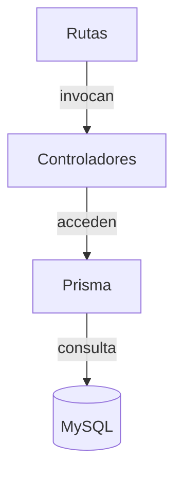

# Manual de la API

Este documento ofrece una visión general de la API del proyecto **backend-pos**. Está pensado para programadores que necesiten integrar o mantener el código.

## Puesta en marcha

1. Instalar dependencias:
   ```bash
   npm install
   ```
2. Ejecutar migraciones y generar el cliente de Prisma:
   ```bash
   npm run prisma:migrate
   npm run prisma:generate
   ```
3. Iniciar el servidor en modo desarrollo:
   ```bash
   npm run dev
   ```

Las variables de entorno se definen en `.env` (ver `.env.example`).

## Estructura del proyecto

```text
src/
  controllers/      Lógica de negocio y acceso a datos
  routes/           Definición de rutas Express
  middlewares/      Middlewares de autenticación y otros
  types/            Declaraciones de tipos adicionales
  utils/            Funciones de utilidad
prisma/
  schema.prisma     Definición del esquema de base de datos
```

### Diagrama general



## Autenticación

La mayoría de las rutas están protegidas mediante JWT. El middleware `verifyToken` valida el token y expone `req.user` con los campos `userId` y `sucursalId`.

### Endpoints de autenticación

- `POST /auth/login` – Devuelve un token JWT si las credenciales son correctas.
- `POST /auth/setup` – Registra la empresa, sucursal y usuario inicial.
- `POST /auth/perfil` – Devuelve los datos del usuario autenticado.
- `POST /auth/send-code` – Envía un código por correo electrónico.
- `POST /auth/reset-password` – Restablece la contraseña usando el correo.

## Recursos principales

A continuación se resumen los endpoints más relevantes. Todos los endpoints (salvo indicación) requieren un encabezado `Authorization: Bearer <token>`.

### Usuarios

- `POST /users/register` – Crea un nuevo usuario.
- `PUT /users/cambiar-password` – Cambia la contraseña del usuario actual.
- `PUT /users/:id` – Edita un usuario.
- `DELETE /users/:id` – Desactiva un usuario.
- `GET /users/activos` – Lista usuarios activos de la sucursal.
- `GET /users/check-email?correo=` – Verifica si un correo ya existe.

### Sucursales

- `GET /sucursales/:id` – Obtiene una sucursal por id.
- `GET /sucursales/:id/correo-notificacion` – Obtiene el correo de notificación de la sucursal.
- `PUT /sucursales/:id` – Edita datos de la sucursal.

### Empresa

- `PUT /empresa/:id` – Renueva la fecha de vencimiento de la empresa.

### Clientes

- `GET /cliente` – Lista clientes.
- `POST /cliente` – Crea cliente.
- `PUT /cliente/:id` – Actualiza cliente.
- `DELETE /cliente/:id` – Elimina cliente.

### Productos

- `GET /producto/productos` – Lista productos.
- `GET /producto/productos/:id` – Obtiene producto por id.
- `POST /producto/productos` – Crea producto.
- `PUT /producto/productos/:id` – Actualiza producto.
- `DELETE /producto/productos/:id` – Elimina producto.
- `GET /producto/productosPaginacion` – Lista productos paginados.
- `GET /producto/productosCodigo/:codigo` – Busca por código de barras.

### Compras

- `GET /compra` – Lista compras.
- `GET /compra/ultimoFolio?sucursalId=` – Último folio registrado.
- `GET /compra/:id` – Detalle de compra.
- `POST /compra` – Registra nueva compra.
- `PUT /compra/:id` – Edita compra.
- `DELETE /compra/:id` – Desactiva compra.

### Gastos e inversiones

- `GET /gasto` – Lista gastos.
- `GET /gasto/rango?inicio=&fin=` – Filtra por rango de fechas.
- `POST /gasto` – Crea gasto.
- `PUT /gasto/:id` – Edita gasto.
- `DELETE /gasto/:id` – Desactiva gasto.
- `GET /inversion` – Lista inversiones.
- `POST /inversion` – Crea inversión.
- `PUT /inversion/:id` – Edita inversión.
- `DELETE /inversion/:id` – Desactiva inversión.

### Retiros e inicios de caja

- `GET /retiro` – Lista retiros.
- `POST /retiro` – Crea retiro.
- `PUT /retiro/:id` – Edita retiro.
- `DELETE /retiro/:id` – Desactiva retiro.
- `GET /inicio` – Lista aperturas de caja.
- `GET /inicio/rango?inicio=&fin=` – Filtra por fechas.
- `POST /inicio` – Crea apertura de caja.
- `PUT /inicio/:id` – Edita apertura.
- `DELETE /inicio/:id` – Desactiva apertura.

### Ventas

- `GET /venta` – Lista ventas.
- `GET /venta/ultimoFolio?sucursalId=` – Último folio registrado.
- `GET /venta/:id` – Detalle de venta.
- `POST /venta` – Registra nueva venta.
- `PUT /venta/:id` – Edita venta.
- `DELETE /venta/:id` – Desactiva venta.

### Pagos

- `GET /payments?empresaId=` – Lista pagos de la empresa ordenados por fecha.

## Pruebas

Las pruebas se ejecutan con `npm test` y utilizan Jest junto con `supertest` para simular llamadas HTTP.

```bash
npm test
```

